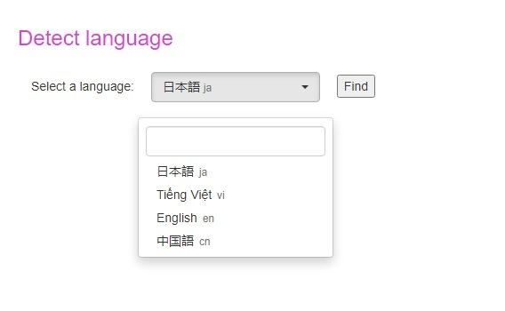

# Language Detector
A simple webpage [ under development ] to find all strings enlisted under a particular language.
 

</img>
 

### 🧐 Features

  - Search bar for searching different languages
  - Scrollable list of languages

### 💻 Built with
 - HTML
 - JavaScript
 - Bootstrap

### 🛠️ How to install and contribute?
- Fork this repository.
- Download the source code and open it in an IDE of your choice.
- Open html/popup.html file in your browser.

